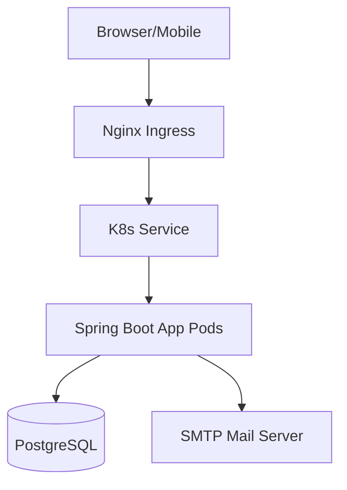

# Fresh Farm Juba Architecture

## Overview
A modern E-commerce platform for agricultural products in South Sudan, built with Spring Boot, Thymeleaf, and PostgreSQL.

## Technology Stack
- **Backend:** Java 21, Spring Boot 3.2.3, Spring Data JPA, Spring Security, Spring Mail
- **Frontend:** Thymeleaf, Bootstrap 5.3, Bootstrap Icons, Animate.css, AOS
- **Database:** PostgreSQL 15
- **Containerization:** Docker, Docker Compose
- **Orchestration:** Kubernetes (K8s)
- **CI/CD:** GitHub Actions

## Infrastructure
- **Development:** Local Spring Boot with DevTools and Docker Compose for DB
- **Deployment:** Containerized deployment using Docker. Kubernetes for production orchestration.
- **Monitoring:** Spring Boot Actuator with liveness/readiness probes.

## Component Diagram

